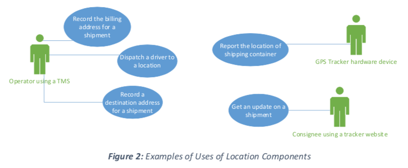
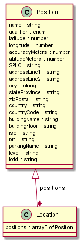

  
  </img>

 
 

<b>Blockchain in Transport Alliance Standards Council (BiTAS)</b>
 
 
 
<i>BSC Std 120-2019: LOCATION COMPONENT SPECIFICATION</i>
 
 
 

> **Note: this format is to demonstrate an option: use the combination of html/markdown to wrap the human readable docuemntation generated from the Location component's Open API spec doc.**

### Contents

- [Versions](#versions)
- [Copyright](#copyright)
- [Acknowledgements](#ackowledgements)
- [Objective](#objective)
- [Introduction](#introduction)
- [Scope](#scope)
- [Glossary](#glossary)
- [References](#references)
- [Data Format Requirements](#Data-Format-Requirements)

### Versions

Version | Date | Author
---------|----------|---------
 BSC Std 120-2019 v1.0 | February 27, 2019 | Pratik Soni, BiTAS Tracking Data WG Chair
BSC Std TBD | May 9, 2020 | DFTC Data Format Technical Committee

### Copyright

[Review copyright section by BiTAS lawyer] The BiTAS Std XXX-20XX: X Component Specification is owned by the Blockchain in Transport Alliance Standards Council. Any attempt to copy this document and use it in whole or in part by any other organization without the express written consent of the Blockchain in Transport Alliance Standards Council will be viewed as copyright infringement.

### Ackowledgements

  &nbsp; |   &nbsp; | &nbsp;
---------|----------|---------
BSC Standard Council Board |
Participant1 | Participant2 | Participant3
BSC Data Format Data Technical Committee |
Participant4 | Participant5 | Participant6
Working Group |
Participant7 | Participant8 | Participant9
Participant10 | Participant11 | Participant12

### Objective

Define a **Location Component specification** to provide a common structure to represent where an activity happens or where someone or something is located.  This construct is fundamental to transportation and logistics operations.  It is also fundamental to supporting business operations such as account management, pricing, and billing.  The structure can represent multiple, necessary forms of geographic identification.

*Through the publication of **Component Specifications**, provide the requirements necessary for other DFTC Working Groups to develop **Document Specifications**.  The primary audience for Document specifications is the BSC Implementation TC (ITC).*

### Introduction

The Location Component is a data structure used whenever a geographic location needs to be represented within a ***host Document*** such one that supports shipment tracking, invoicing, etc.  The Location Component, as a self-contained structure, contains all the information needed to determine a geographic location.

The Location Component is used to define the location of any type of object or entity regardless of whether it is fixed (e.g. a building, port, rail station, etc) or mobile (e.g. a vehicle or shipping container, etc.).

A Location Component is a data structure that is always embedded a host Document.  In other words, a Location Component can never exist in isolation on the blockchain. This is because the other data structure(s) define the accompanying data depending on the purpose of the Location Component. 

Examples:
-	Track the location of a shipping container
-	Record the destination address of a shipment
-	Record the billing address of a customer for a shipment
-	Dispatch a driver to a location

### Scope

-	Identify where an item is or has been within a journey 
-	Identify where an item is planned to be within an itinerary
-	Transportation and logistics use cases involving tracking and tracing.  As such airline, railway, roadway, ocean, and fixed warehousing and related custodial operations  such as pickup, delivery, drayage, customs, etc. are in scope.
-	Identify standard data elements & attributes known across multiple industries to form a starting data structure with the ability to add custom and/or unique Position attributes that provide greater position accuracy.

#### Out of scope:

-	Consistent with the generalized nature of a Component Specification, the context for how this specification is used is not covered.  This will be provided in the BSC Document specification where this component is utilized.

### Glossary

Term or Abbreviation | Definition
---------|----------
AAR | Association of American Railroads
FRA | Federal Railroad Administration
SPLC | Standard Point Location Code
FSAC | Freight Station Accounting Code

### References

Reference Name | Reference Organization
---------|----------
ISO 3166: [Codes for the representation of names of countries and their subdivisions Part 1: Country codes](https://www.iso.org/iso-3166-country-codes.html) | ISO
[Standard Point Location Code](https://www.railinc.com/rportal/standard-point-location-code)| RAILINC

### Data Format Requirements

*The requirements associated to this data structure are captured using the [Open API Specification](https://en.wikipedia.org/wiki/OpenAPI_Specification) (OAS).  The intention is to use OAS to streamline the means to capture data requirements to include such items as:
-	Standard data element names following standard naming conventions
-	Data relationships (e.g. associative, hierarchical)
-	Multiplicity/cardinality
-	Valid values including enumerations
-	Required vs. optional

This is a logical requirements specification and does not consider a specific technology or implementation.  It is anticipated the BSC Implementation TC (ITC) can and will choose a different organization that is optimal for storage and retrieval given implementation specifics and interoperability considerations.  The use of OAS by DFTC in this logical specification does not specify or imply a physical API or JSON storage structure.*

#### Diagram

 
 

#### Requirements

